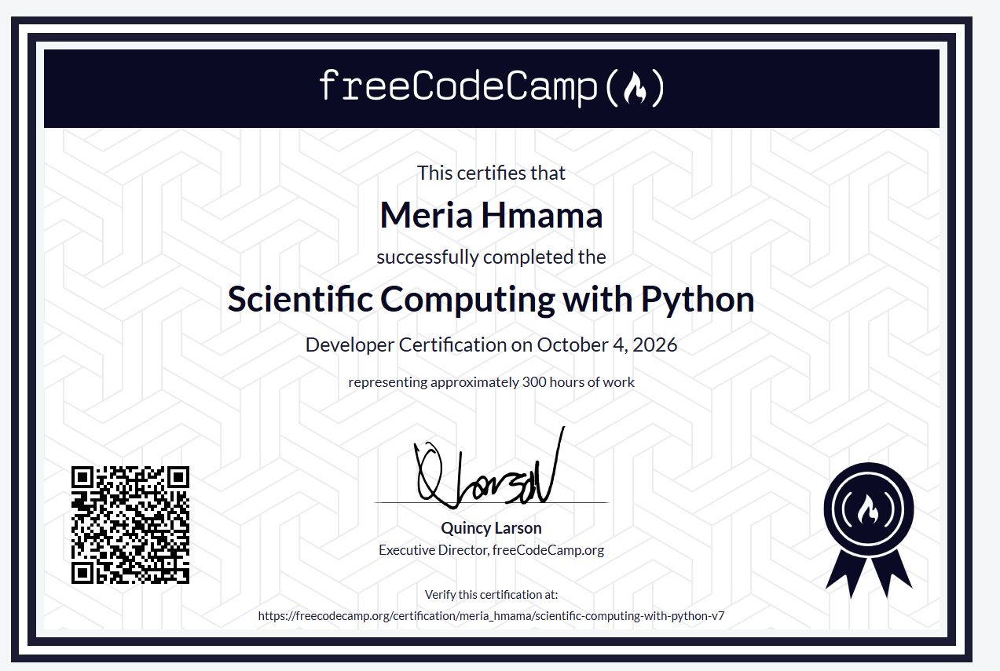

#  Scientific Computing with Python - freeCodeCamp

This repository contains the projects I completed as part of the **freeCodeCamp Scientific Computing with Python Certification**.

These projects helped me strengthen my Python programming skills through practical exercises involving problem solving, object-oriented programming, data structures, algorithms, and simulations.

## 📂 Projects

### 1. Arithmetic Formatter

A Python program that formats arithmetic problems vertically and side-by-side.

**File:** `Arithmetic_Formatter_Project.py`

### 2. Time Calculator

A program that calculates a new time after adding a specified duration to a starting time.

**File:** `Time_Calculator_Project.py`

### 3. Budget App

An object-oriented Python application for managing budget categories, deposits, withdrawals, transfers, and spending.

**File:** `Budget_App_Project.py`

### 4. Polygon Area Calculator

A project using Python classes and inheritance to work with rectangles and squares and calculate their properties.

**File:** `Polygon_Area_Calculator_Project.py`

### 5. Probability Calculator

A Python simulation project that performs random experiments to estimate probabilities.

**File:** `Probability_Calculator_Project.py`

## 🛠️ Skills Demonstrated

Through these projects, I practiced:

- Python programming
- Object-Oriented Programming (OOP)
- Classes and inheritance
- Functions
- Data structures
- String manipulation
- Algorithms
- Random simulations
- Problem solving

## 🎓 Certification

I successfully completed the **freeCodeCamp Scientific Computing with Python Certification**.

### Certificate



## 📁 Repository Structure

```text
fcc-scientific-computing-python/
│
├── Arithmetic_Formatter_Project.py
├── Budget_App_Project.py
├── Polygon_Area_Calculator_Project.py
├── Probability_Calculator_Project.py
├── Time_Calculator_Project.py
├── Certif.JPG
├── .gitignore
└── README.md